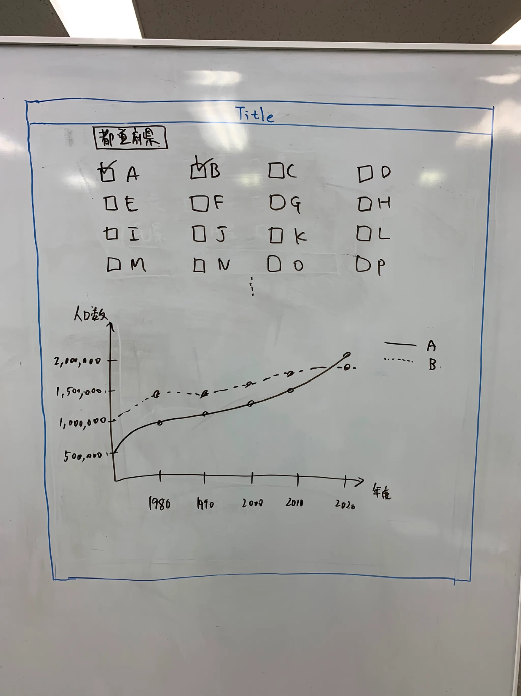

# yumemi-coding-test

[vercel page](https://yumemi-coding-test-puce.vercel.app/)

## Available commands

In this project, you can run the following scripts:

| Script     | Description                                                                 |
| ---------- | --------------------------------------------------------------------------- |
| dev        | Runs the app in the development mode.                                       |
| build      | Builds the app for production to the `dist` folder.                         |
| lint       | Runs the Eslint and show code problems.                                     |
| format     | Runs the Prettier and fix code style.                                       |
| preview    | Builds the app for production to the `dist` folder, and run locally server. |
| test       | Run the app tests.                                                          |
| test:watch | Run the app tests in watch mode.                                            |
| commit     | commit with commitizen.                                                     |
| version    | generate version change log.                                                |

## wire frame

---

# Good
- 独自にワイヤーフレームを解釈してデザイン・実装している*
- API で取得したデータをキャッシュしている
- API のエラーハンドリングができている
- 通信時のローディングの UI を実装している
- データが存在しないときに専用の UI を用意している
- 良いインタラクションを与えるアニメーションを実装している
- Lighthouse のスコアで高い評価となっている
- CI を構築している
- コミットの粒度、メッセージが適切である
- コミットに prefix がついている
- データがないときのUIやチェックボックスを押下した時の挙動などよく考えられており全体的に視認性のよいアプリケーションである印象を受けました
- apiの実装周りでしっかり抽象化が行われており堅牢なコードベースが出来上がっている印象です
- テストコードも不足なく書かれているので信頼性が高くデグレ検知に強い印象です
- MB時に要素がファーストビューに収まるよう、チェックボックスをスクロールエリアにするといった工夫されていた点がよいなと思いました

# Next
- チェックボックスをダブルクリックするとオフでもグラフ表示される
- html 要素の lang が ja でない
- 使用しているライブラリの ver が古い
  - "vitest": "^0.34.6”
- 複雑なビジネスロジックがコンポーネントに存在している
- 複雑なビジネスロジックについてコメントがない
- Typo がある
- コードがフォーマットされていない(pnpm run format で差分検出される)
- 全体的にドキュメンテーションが不足しているかと思います。コードベースにおいてはJSdoc, READMEにおいては環境構築方法や環境変数の取り扱いについて
- チェックボックスを連続でクリックすると非チェック時でもグラフが表示されてしまいます

# 総評
お忙しい中コードチェックに取り組んでいただきありがとうございました。

全体として、視認性の良いUIや堅牢なコードベース、充実したテストコードにより、高い信頼性を感じます。アニメーションが実装されていたりレスポンシブへの配慮からUIへのこだわりがとても感じられ、触っていて楽しいアプリケーションでした。
一方で、ドキュメンテーションの不足や一部操作時の挙動に改善の余地がありますが、全体的に完成度の高い仕上がりとなっているかと思いました。

